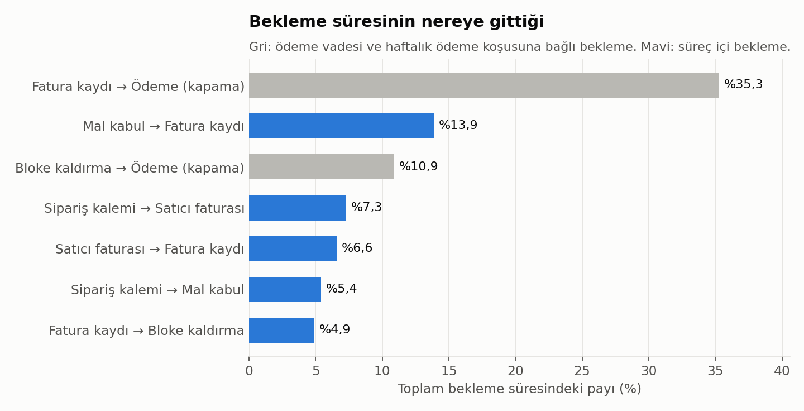
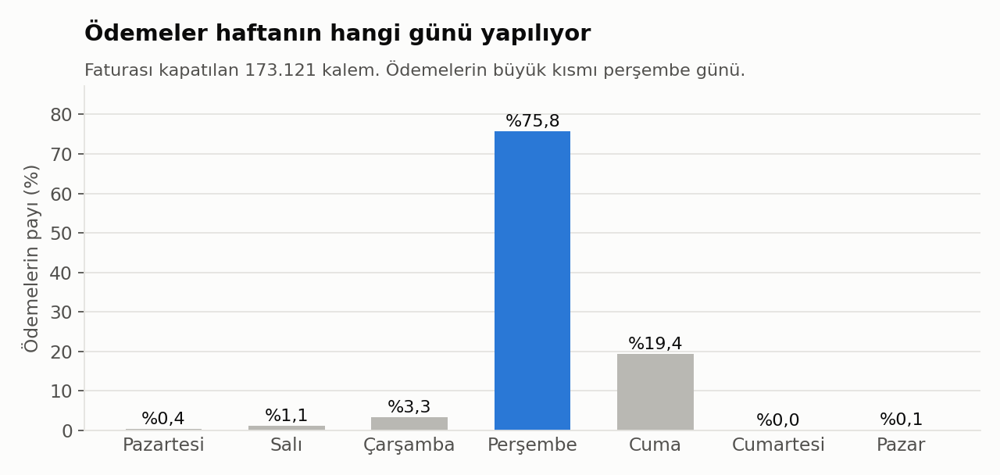
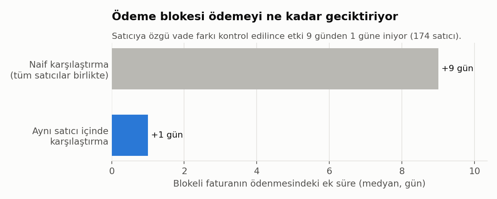
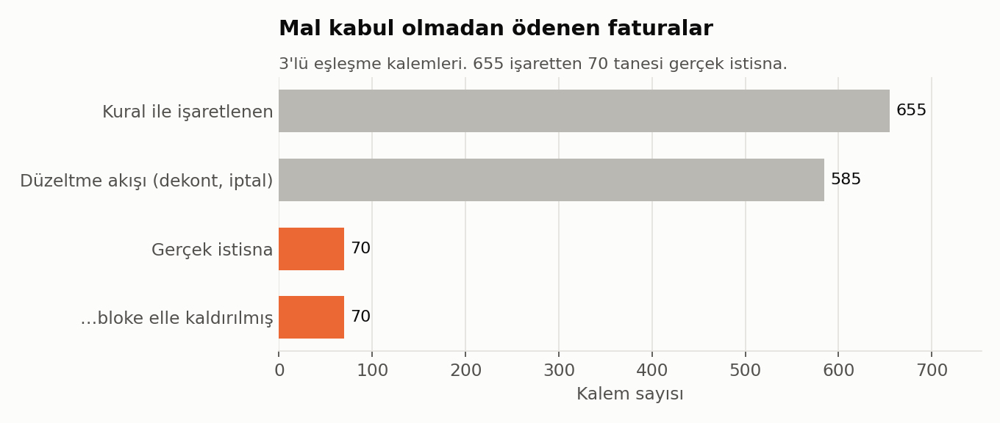

# Satın Alma–Ödeme (P2P) Süreç Madenciliği: Bekleme Nerede, Kontrol Nerede Delinir?

**Veri:** BPI Challenge 2019, çok uluslu bir boya ve kaplama şirketinin SAP satın alma sürecinden anonimleştirilmiş gerçek olay günlüğü. 1.595.923 olay, 251.734 sipariş kalemi, 1.975 satıcı, 2018 yılı.
**Yöntem:** Python (pandas), kural tabanlı uyum testleri, doğrudan-takip (directly-follows) bekleme analizi, satıcı içi karşılaştırma.
**Yeniden üretim:** `make all` komutu tüm sayıları ve grafikleri ham veriden yeniden hesaplar.

> **English summary.** Process-mining analysis of the BPI Challenge 2019 purchase-to-pay event log (1.6M events, SAP). Three findings. (1) The largest share of waiting time, 35% (invoice receipt → payment), comes from payment terms and a weekly payment run (76% of payments clear on Thursdays), so it is not a bottleneck and shortening it would cost working capital. (2) Payment blocks look like a 9-day delay, but comparing within the same vendor cuts this to 1 day: the naive gap is confounded by vendor payment terms. (3) A "paid without goods receipt" rule flags 655 items. 585 of them are correction flows (debit memos, cancellations). The remaining 70 real exceptions all had their payment block removed manually, and one user accounts for 69% of those releases versus 36% of all releases.

---

## Özet bulgular

| # | Bulgu | Sayı |
|---|---|---|
| 1 | En büyük bekleme (fatura kaydı → ödeme) bir darboğaz değil, ödeme politikasıdır. | Toplam beklemenin %35,3'ü; ödemelerin %75,8'i perşembe |
| 2 | Ödeme blokesinin gecikme etkisi naif ölçümde abartılıyor. | Naif +9 gün → satıcı içi +1 gün |
| 3 | "Mal kabulsüz ödeme" kuralının işaretlerinin %89'u yanlış pozitif. Gerçek istisnaların tamamında bloke elle kaldırılmış. | 655 → 70; tek kullanıcı %68,5 |
| 4 | Asıl kontrol edilebilir bekleme, mal kabul ile fatura kaydı arasında. | Medyan 12,3 gün; toplam beklemenin %13,9'u |

---

## Bulgu 1: En büyük bekleme darboğaz değil

**Durum.** Siparişten ödemeye medyan süre 77,3 gün, 90. yüzdelik 128 gün (173.503 ödenmiş kalem). Doğrudan-takip analizinde toplam bekleme süresinin %35,3'ü tek bir geçişte birikiyor: *fatura kaydı → ödeme* (medyan 37,2 gün).



**Mekanizma.** Bu geçişteki süre rastgele dağılmıyor:
- Ödemelerin %75,8'i perşembe, %19,4'ü cuma günü yapılıyor. Bu, haftalık bir ödeme koşusunun (payment run) izidir.
- Satıcı faturası ile ödeme arasındaki sürenin standart sapması tüm veri setinde 30,9 gün. Aynı satıcının kalemleri içinde ise medyan 14,3 güne düşüyor (en az 50 kalemi olan 337 satıcı). Süre büyük ölçüde satıcıya özgü vadeyle belirleniyor.



**Kök neden.** Bu bekleme süreç verimsizliğinden değil, bilinçli nakit yönetiminden kaynaklanıyor: vade ile haftalık ödeme takvimi.

**Öneri.** Bu geçiş "darboğaz" olarak ele alınıp kısaltılmamalı. Kısaltmak işletme sermayesine mal olur. Süreç iyileştirme hedefi, vadeden bağımsız bekleme olan mal kabul → fatura kaydı (Bulgu 4) olmalıdır. Vade analizi ayrı bir soru olarak ele alınmalı: vadeler sözleşmeyle uyumlu mu, erken ödeme iskontosu kaçırılıyor mu?

**Kanıt.** [`reports/tables/darbogaz_gecisler.csv`](reports/tables/darbogaz_gecisler.csv), `results.json → payment_run`.

---

## Bulgu 2: Ödeme blokesinin etkisi abartılıyor

**Durum.** Ödenmiş kalemlerin %28'inde ödeme blokesi kaldırılmış. Naif karşılaştırmada blokeli kalemler satıcı faturasından ödemeye medyan 9 gün daha geç ödeniyor. Tüm çevrim süresinde fark daha büyük görünüyor: 86,8 güne karşı 72,8 gün.

**Mekanizma.** Blokeli kalemler rastgele dağılmıyor, belirli satıcılarda yoğunlaşıyor. Bu satıcıların vadeleri de farklı. Aynı satıcı içinde blokeli ve blokesiz kalemler karşılaştırıldığında (her iki grupta en az 30 kalemi olan 174 satıcı, 42.823 blokeli kalem) fark medyan 1 gün, ağırlıklı ortalamada 2,1 gün.



**Kök neden.** Naif farkın büyük kısmı satıcı karması (vade farkı) kaynaklı. Blokenin kendisi kısa sürede çözülüyor: mal kabul ve fatura hazır olduktan sonra bloke medyan 4,9 günde kaldırılıyor.

**Öneri.** Bloke sürecine otomasyon yatırımı, yalnızca naif farka bakılarak gerekçelendirilmemeli. Beklenen kazanç kalem başına gün değil, iş gücüdür: bloke kaldırma işlemlerinin %73'ü elle yapılıyor (40.615 kalem). Geri kalanı zaten toplu işle (batch) çalışıyor.

**Kanıt.** [`reports/tables/bloke_etkisi_satici_ici.csv`](reports/tables/bloke_etkisi_satici_ici.csv), `results.json → payment_run.block_effect`.

---

## Bulgu 3: Mal kabul olmadan ödeme, gerçek istisnalar

**Durum.** 3'lü eşleşme kuralına göre malı teslim alınmamış bir kalemin faturası ödenmemeli. Bu kural 183.374 ödenmiş kalemde test edildi: 566 kalemde hiç mal kabul yok, 89 kalemde ödeme ilk mal kabulden önce yapılmış. Toplam 655 işaret var.

**Mekanizma.** 655 işaretin 585'inde satıcı alacak dekontu veya iptal kaydı var. Bu vakalarda "Clear Invoice" bir ödeme değil, bir düzeltmenin kapatılmasıdır. Geriye 70 gerçek istisna kalıyor (ödenmiş kalemlerin %0,038'i, kalem değeri toplamı yaklaşık 144 bin €).



**Kök neden.** 70 istisnanın tamamında sistem faturayı bloke etmiş, ardından bir kullanıcı blokeyi elle kaldırmış. Kontrol çalışıyor, delinen yer manuel müdahale:
- Bu istisnalardaki bloke kaldırma işlemlerinin %68,5'i tek bir kullanıcıya (`user_015`) ait. Bu kullanıcının tüm bloke kaldırmalar içindeki payı %35,8. İstisnalarda yaklaşık iki kat fazla temsil ediliyor.
- İstisnaların 38'i (%54,3) tek bir satıcıda (`vendorID_0660`, MRO bileşenleri), 44'ü CAPEX & SOCS harcama alanında.

**Öneri.**
1. Mal kabulü olmayan kalemde bloke kaldırma işlemi, gerekçe kodu zorunluluğuna ve ikinci onaya bağlanmalı.
2. `vendorID_0660` için mal kabul kaydının neden atlandığı süreç sahibiyle incelenmeli. Olası neden, MRO bileşenlerinin depoya girmeden tüketime verilmesi.
3. Kural tabanlı uyum raporları, düzeltme akışlarını dışarıda bırakacak şekilde yeniden tanımlanmalı. Aksi halde denetim ekibinin zamanının yaklaşık %89'u yanlış pozitiflere gider.

**Kanıt.** [`reports/tables/K2_ihlal_vakalari.csv`](reports/tables/K2_ihlal_vakalari.csv) (`correction` sütunu ayrımı gösteriyor), `results.json → compliance.K2_paid_without_gr`.

---

## Bulgu 4: Kontrol edilebilir bekleme

**Durum.** Vade dışı en büyük bekleme *mal kabul → fatura kaydı* geçişi: medyan 12,3 gün, toplam beklemenin %13,9'u. Satıcı faturasının sisteme kaydı ise medyan 4,6 gün sürüyor (%6,6).

**Mekanizma.** "Satıcı faturası" olayı belge tarihidir: gün hassasiyetinde tutulur, saati hep 23:59'dur. "Fatura kaydı" ise faturanın sisteme işlendiği andır. Aradaki 4,6 günlük fark, faturanın yakalanma ve giriş gecikmesidir. Fatura kaydı olmadan eşleşme ve bloke çözümü başlayamadığı için bu gecikme, sonraki adımların tamamını öteler.

**Öneri.** Fatura girişinin otomatikleştirilmesi (e-fatura/PEPPOL ile yapılandırılmış fatura alımı) bu iki geçişi doğrudan hedefler. Etkinin ölçümü için hedef metrik: satıcı faturası → fatura kaydı medyanı.

---

## Diğer kontroller

| Kontrol | Sonuç |
|---|---|
| K1: 3'lü eşleşme (fatura mal kabulden sonra) kategorisinde fatura, mal kabulden önce kaydedilmiş mi? | 11.128 kalem, **0 ihlal**. Sistem kontrolü eksiksiz çalışıyor. |
| K3: Konsinye kalemlerde fatura var mı? | 14.498 kalem, **0 ihlal**. |
| K4: Satıcı faturasından fazla ödeme (mükerrer ödeme sinyali) | 444 işaret; 312'si düzeltme akışı; **132 temiz sinyal**, 54 satıcıda. İlk 10 satıcı %59,8. Bu kalemler tek tek incelenmesi gereken bir liste, kesin tespit değil. |
| Fazla fatura kaydı, iptalsiz | 1.862 kalem. Yalnızca 109'u fazladan ödemeye dönüşüyor: mükerrer kayıtların çoğu ödeme öncesinde yakalanıyor. |
| Yeniden işleme (fiyat/miktar değişikliği, silme, iptal) | Kalemlerin %16,3'ü. Yeniden işlenen kalemlerde medyan çevrim 94,2 gün, diğerlerinde 73,4 gün. |
| Süreç varyantları | 8.620 farklı akış. En sık akış %21,7, ilk 10 akış %61,1. 6.124 akış yalnızca bir kez görülüyor. |

Harcama alanı kırılımı: [`reports/figures/05_harcama_alani.png`](reports/figures/05_harcama_alani.png).

---

## Veri kalitesi ve sınırlar

- **Zaman damgası anomalileri:** 327 olay (271 kalem) 2018 penceresinin dışında. En eskisi 1948, en yenisi 2020. Bu kalemler süre analizlerinden çıkarıldı.
- **Tutar eşleşmesi test edilemiyor:** `Cumulative net worth` alanı kalemlerin %98,2'sinde tüm olaylar boyunca sabit. Olay başına fatura veya mal kabul tutarı değil, kalemin değeri. Bu yüzden 3'lü eşleşmenin tutar boyutu bu veriyle test edilmedi. Yalnızca sıra ve varlık kontrolleri yapıldı. Raporlanan € tutarları "etkilenen kalemin değeri"dir, ödeme tutarı değildir.
- **Nedensellik:** Bulgular gözlemseldir. Bulgu 2'deki satıcı içi karşılaştırma vade karıştırıcısını kontrol eder, diğer karıştırıcıları (kalem tipi, dönem) kontrol etmez.
- **Kullanıcı ve satıcı kimlikleri** veri setinde anonimdir. Bir kullanıcının yüksek payı hata değil, iş dağılımı da olabilir. Öneri bir kişiyi değil, kontrol tasarımını hedefler.

---

## Yeniden üretim

```bash
git clone https://github.com/olcayto-akbudak/p2p-surec-madenciligi.git
cd p2p-surec-madenciligi
python -m venv .venv && source .venv/bin/activate
pip install -r requirements.txt
make all        # indirme → parquet → analiz → grafikler (~1 dk)
```

```
src/
  download.py   veri indirme ve SHA-256 doğrulama
  load.py       CSV → parquet, kolon sadeleştirme
  analysis.py   uyum kuralları, bekleme, bloke etkisi, varyantlar → reports/results.json
  figures.py    README grafikleri
reports/
  results.json  README'deki tüm sayıların kaynağı
  tables/       kural ihlal listeleri ve kırılım tabloları
  figures/
```

## Kaynak ve lisans

- Veri: van Dongen, B.F. (2019). *BPI Challenge 2019*. 4TU.ResearchData. [doi:10.4121/uuid:d06aff4b-79f0-45e6-8ec8-e19730c248f1](https://doi.org/10.4121/uuid:d06aff4b-79f0-45e6-8ec8-e19730c248f1). Veri bu depoda yer almaz. `make data` resmî dosyanın herkese açık bir kopyasını indirir ve SHA-256 ile doğrular.
- Kod: MIT lisansı.
- Bu çalışma yalnızca kamuya açık veriye dayanır. Herhangi bir işverenin veya müşterinin verisini, dokümanını ya da bilgisini içermez.
